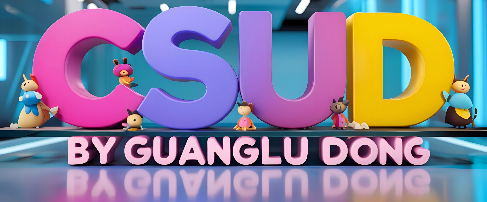
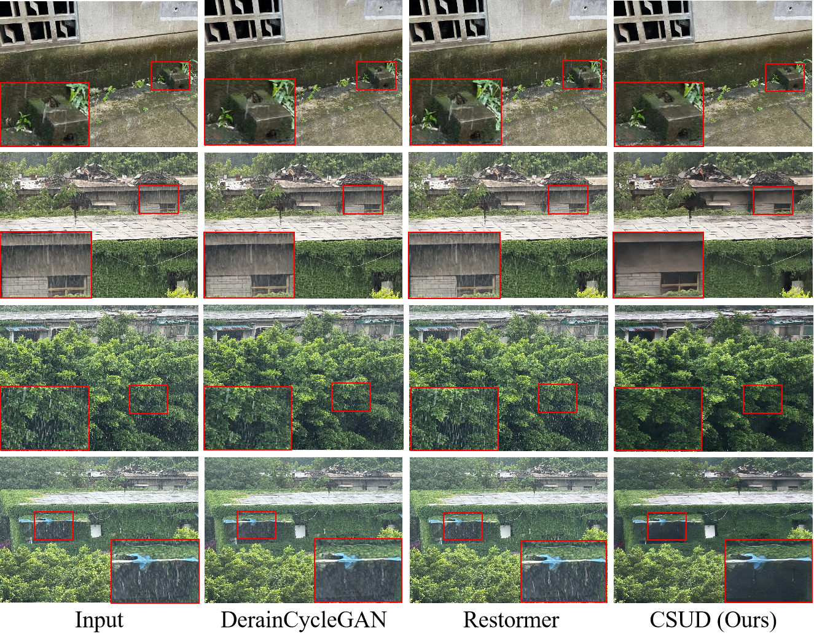

# [CVPR2025] Channel Consistency Prior and Self-Reconstruction Strategy Based Unsupervised Image Deraining

    

This repository is the official implementation of CVPR 2025 "Channel Consistency Prior and Self-Reconstruction Strategy Based Unsupervised Image Deraining".

<a href="https://arxiv.org/abs/2503.18703">"></a>

 **[Channel Consistency Prior and Self-Reconstruction Strategy Based Unsupervised Image Deraining](https://arxiv.org/abs/2503.18703)**
  
[Guanglu Dong](https://github.com/GuangluDong0728) $^{1}$,
Tianheng Zheng $^{1}$,
Yuanzhouhan Cao $^{2}$,
Linbo Qing $^{1}$,
Chao Ren $^{1}$ \*

$^{1}$ Sichuan University,
$^{2}$ Beijing Jiaotong University

# Code is Coming soon!!
